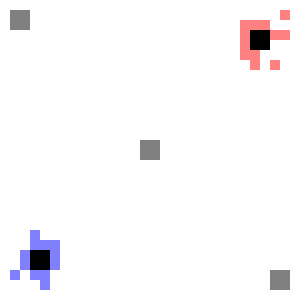

# Projet Fourmis
Projet de simulation de fourmis qui récupèrent du sucre et le ramène vers leur nid grâce à leurs phéromones.

Il s'agit de mon projet de fin de semestre pour le cours de programmation modulaire en L1 MI à l’Université Paris-Saclay.
`2021` - `C++`, `Simulation `, `Langage Objet`, `Génération d’images`, `CLion`

### Résultat
Voici l'un des résultat généré par mon programme.

Pour obtenir plus d'informations sur ce projet n'hésitez à consulter le sujet : [Sujet](https://github.com/Julien-LG/Projet-Fourmis/blob/main/projet_fourmis.pdf)

## Conclusion

Ce projet m’a permis d’obtenir la note de 18/20.
